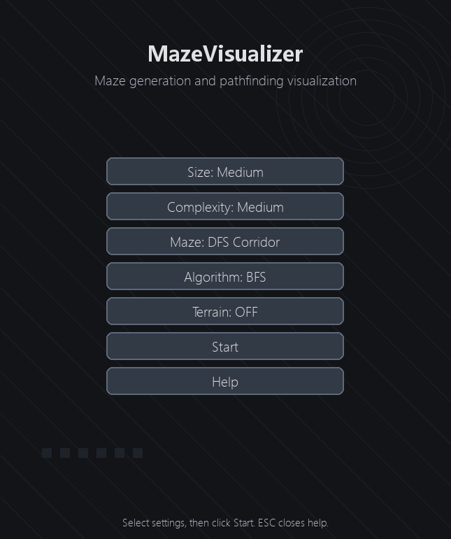
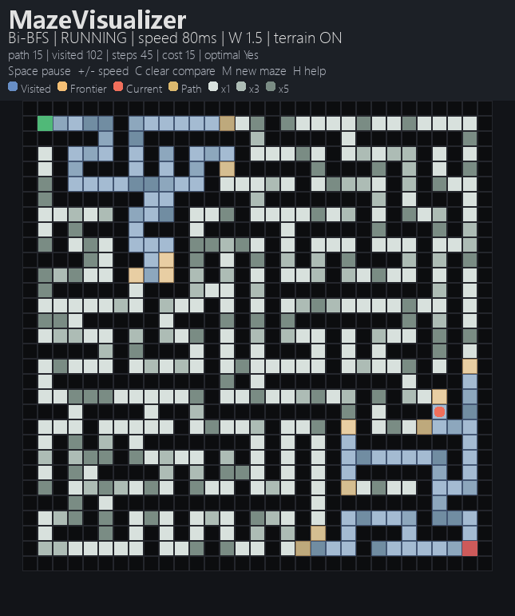
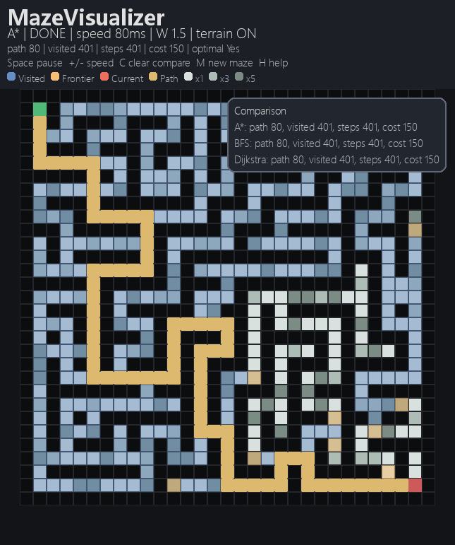

# MazeVisualizer

[](https://www.python.org/)
[](https://www.pygame.org/)
[](https://docs.pytest.org/)
[](LICENSE)

[中文说明 / Chinese README](README_zh.md)

> Repository: [https://github.com/janxu2417/MazeVisualizer](https://github.com/janxu2417/MazeVisualizer)

<details>
  <summary>Table of Contents</summary>
  <ol>
    <li><a href="#project-background">Project Background</a></li>
    <li><a href="#features">Features</a></li>
    <li><a href="#project-structure">Project Structure</a></li>
    <li><a href="#built-with">Built With</a></li>
    <li><a href="#core-algorithms">Core Algorithms</a></li>
    <li><a href="#interactive-editing">Interactive Editing</a></li>
    <li><a href="#controls">Controls</a></li>
    <li><a href="#getting-started">Getting Started</a></li>
    <li><a href="#testing">Testing</a></li>
    <li><a href="#roadmap">Roadmap</a></li>
    <li><a href="#license">License</a></li>
    <li><a href="#acknowledgments">Acknowledgments</a></li>
    <li><a href="#ai-tool-declaration">AI Tool Declaration</a></li>
  </ol>
</details>

<a id="project-background"></a>
## Project Background

MazeVisualizer is a Python + Pygame project for visualizing maze generation and pathfinding algorithms step by step.
It is designed as a Data Structures and Algorithms course project with emphasis on:

- self-implemented maze generation and graph search logic
- clear separation between algorithm logic and UI rendering
- visual comparison between different search strategies
- explainable algorithm behavior rather than black-box library calls

## Features

- Maze generation: DFS backtracking, Prim, Kruskal
- Pathfinding: BFS, Dijkstra, A*, Bidirectional BFS, Greedy Best-First, Weighted A*
- Frontier / open-set visualization
- Bidirectional BFS two-side expansion visualization
- Weighted terrain mode for cost-sensitive shortest path
- Runtime stats: path length, visited nodes, search steps, path cost, optimality
- Comparison board for multiple algorithms on the same maze

## Project Structure

```
MazeVisualizer/
├── src/
│   ├── step_data.py       # shared types (Grid, Point, CostMap, RunStats, StepState)
│   ├── maze_gen.py        # maze generation (DFS / Prim / Kruskal)
│   ├── pathfinding.py     # 6 pathfinding solvers + shared helpers
│   ├── algorithms.py      # re-export compatibility layer
│   ├── app.py             # FSM event loop, state management, edit/run logic
│   ├── render.py          # all drawing (HUD, legend, menu, overlay, comparison)
│   ├── config.py          # AppConfig dataclass, presets, colour palette, help text
│   ├── theme.py           # 4 colour themes (dark / ocean / forest / sunset)
│   ├── menu.py            # menu button builders + click dispatch
│   ├── edit.py            # maze editor state machine + undo stack
│   ├── main.py            # entry point
│   └── ui.py              # alternative entry point
├── docs/                  # screenshots
├── tests/
│   ├── conftest.py        # shared sys.path configuration
│   ├── test_algorithms.py # algorithm correctness
│   ├── test_algorithm_states.py  # StepState interface + bidirectional stats
│   ├── test_app_logic.py  # FSM logic, import/export, history navigation
│   └── test_render_smoke.py     # headless rendering smoke tests
├── pytest.ini
├── README.md
├── README_zh.md
├── LICENSE
└── requirements.txt
```

### Data Flow

```
User Input (mouse / keyboard)
        │
        ▼
  run_app()  ◄──  FSM: menu → algo → edit → run
        │
        ├── _dispatch_menu_event()
        ├── _dispatch_algo_event()
        ├── _dispatch_edit_event()
        └── _dispatch_run_event()
                │
                ▼
         _handle_keydown()  ──►  _reset_solver() / _reset_maze()
                │                       │
                ▼                       ▼
         _step_solver()  ◄──  SolverIterator (yield StepState)
                │
                ▼
         draw_run_view()
           ├── base_surface (static grid + terrain)
           ├── draw_overlay()  (visited / frontier / path / markers)
           └── draw_hud()
                 ├── status, stats, progress
                 ├── draw_legend()
                 └── draw_comparison_board()
```

<p align="right">(<a href="#mazevisualizer">back to top</a>)</p>

## Built With

- Python 3.13
- Pygame 2.5+
- Pytest 8+
- Standard-library data structures: `deque`, `heapq`, `dataclasses`, custom Union-Find

<p align="right">(<a href="#mazevisualizer">back to top</a>)</p>

<a id="core-algorithms"></a>
## Core Algorithms

### Maze Generation

#### 1. DFS Backtracking

- The maze grid uses `0 = wall`, `1 = path`
- The algorithm moves in steps of 2 cells to preserve wall layers
- A stack records the current carving path
- When no unvisited neighbor exists, it backtracks

This creates corridor-like mazes with long passages.

#### 2. Prim-based Maze Generation

- Treat each candidate cell as a graph node
- Maintain a frontier set around the carved region
- Randomly choose a frontier cell and connect it to the existing tree

This tends to create more local branches and dead ends.

#### 3. Kruskal-based Maze Generation

- Treat odd-index cells as graph vertices
- Treat removable walls as candidate edges
- Use a disjoint-set union structure to connect components without cycles

This is a direct application of minimum-spanning-tree style thinking.

### Pathfinding

| Algorithm | Idea | Optimal? | Typical Time | Typical Space | Notes |
| :-- | :-- | :-- | :-- | :-- | :-- |
| BFS | layer-by-layer expansion | Yes on unweighted grids | `O(V+E)` | `O(V)` | shortest step count |
| Dijkstra | greedy shortest path by accumulated cost | Yes with nonnegative weights | `O((V+E)logV)` | `O(V)` | needed for weighted terrain |
| A* | Dijkstra + heuristic | Yes if heuristic is admissible | usually better than Dijkstra | `O(V)` | uses Manhattan distance |
| Bi-BFS | expand from both start and goal | Yes on unweighted grids | often less search in practice | `O(V)` | strong teaching value |
| Greedy Best-First | heuristic only | No | often fast | `O(V)` | may find suboptimal routes |
| Weighted A* | `f(n)=g(n)+W*h(n)` | Not always | often faster than A* | `O(V)` | trades optimality for speed |

### Course Knowledge Points Coverage

This project maps directly to the following topics from the Data Structures & Algorithms curriculum:

| Course Topic | Where Applied | Implementation Detail |
| :-- | :-- | :-- |
| **DFS / Backtracking** | DFS maze generation | Explicit stack, 2-cell step carving, backtrack on dead-end |
| **BFS (FIFO Queue)** | BFS solver, Bi-BFS | `collections.deque`, layer-by-layer expansion |
| **Graph representation** | All solvers | Implicit grid graph → 4-directional adjacency; no explicit edge list |
| **Priority Queue / Binary Heap** | Dijkstra, A*, Greedy, Weighted A* | `heapq` with tuples `(priority, ...)` |
| **Shortest Path (Greedy paradigm)** | Dijkstra | Edge relaxation, non-negative weights, optimality proof |
| **Heuristic / Informed Search** | A*, Greedy, Weighted A* | Manhattan distance `|dr|+|dc|`, admissible & consistent |
| **Bidirectional Search** | Bi-BFS | Two simultaneous BFS fronts, meet-point detection |
| **Union-Find / Disjoint-Set Union** | Kruskal maze generation | Path compression + union by rank, near-O(1) amortised |
| **Minimum Spanning Tree** | Prim & Kruskal maze gen | Frontier expansion (Prim), random edge processing (Kruskal) |
| **Algorithm Correctness & Testing** | Full test suite | 71 automated tests covering optimality, edge cases, state interfaces |
| **Separation of Concerns** | `src/` module layout | `algorithms.py` (logic) vs `render.py` (GUI) via unified `StepState` frames |
| **Complexity Analysis** | Every algorithm | Time & space documented in docstrings and README tables |

### Comprehensive Complexity Comparison

| Algorithm | Best Case | Average / Expected | Worst Case | Space | Optimal? | Heuristic? |
| :-- | :-- | :-- | :-- | :-- | :-- | :-- |
| DFS Maze Gen | Θ(V) | Θ(V) | Θ(V) | O(V) | — | — |
| Prim Maze Gen | Θ(V) | Θ(V) | Θ(V) | O(V) | — | — |
| Kruskal Maze Gen | Θ(V·α(V)) | Θ(V·α(V)) | Θ(V·α(V)) | O(V) | — | — |
| BFS | Ω(1) | Θ(V+E) | O(V+E) | O(V) | Yes (unweighted) | No |
| Dijkstra | Ω(1) | Θ((V+E)logV) | O((V+E)logV) | O(V) | Yes (non-neg) | No |
| A* | Ω(1) | < Dijkstra | O((V+E)logV) | O(V) | Yes (admissible) | Manhattan |
| Bi-BFS | Ω(1) | O(b^(d/2)) | O(b^d) | O(V) | Yes (unweighted) | No |
| Greedy Best-First | Ω(1) | often fast | O((V+E)logV) | O(V) | No | Manhattan |
| Weighted A* | Ω(1) | < A* | O((V+E)logV) | O(V) | ε-admissible | Manhattan |

*V = number of passable cells, E = number of edges between passable cells, b = branching factor, d = shortest path depth, α = inverse Ackermann function.*

On a uniform grid, BFS, Dijkstra, and A* often end with the same shortest path length.
To better demonstrate the difference between unweighted and weighted shortest-path problems, this project adds an optional weighted terrain mode:

- normal road cost = 1
- medium terrain cost = 3
- heavy terrain cost = 5

In this mode:

- BFS still minimizes step count only
- Dijkstra minimizes total path cost
- A* and Weighted A* use both cost and heuristic information

This makes the algorithm comparison more meaningful for a course project.

## Visualization Design

Each solver yields step-by-step state frames. Every frame contains:

- current node
- visited set
- frontier / open set
- final path
- runtime stats
- extra two-side visited sets for Bidirectional BFS

UI updates in the current version:

- `visited`, `frontier`, and `current` use stable A/B/C color layers instead of flashing path previews
- for non-DFS-style algorithms, the path is drawn only after the goal is reached, which avoids flicker at high speed
- a built-in legend explains search colors and weighted-terrain cost bands
- Small / Medium / Large presets also adjust outer padding and font sizes for better screen fit

This design keeps algorithm logic independent from Pygame rendering.

<a id="interactive-editing"></a>
## Interactive Editing

The project supports manual maze testing in addition to preset demos. From the main menu, click **Edit Maze** to enter edit mode, then press `R` to run the selected algorithm on the edited maze.

| Tool | Key | Purpose |
| :-- | :-- | :-- |
| Draw Wall/Path | `D` | Click or drag to toggle between wall and path |
| Place Start | `S` | Set a custom start point |
| Place Goal | `G` | Set a custom goal point |
| Paint Terrain | `T` | Cycle passable terrain cost through `1 → 3 → 5` |
| Inspect Cell | `I` | Hover to inspect coordinates, cell type, and search state |
| Undo | `Ctrl+Z` | Revert the latest edit action |

This makes the project an experiment tool for constructing edge cases, comparing algorithms on custom layouts, and demonstrating why weighted shortest-path algorithms differ from unweighted BFS.

<p align="right">(<a href="#mazevisualizer">back to top</a>)</p>

<a id="controls"></a>
## Controls

- `Space`: pause / resume
- `H`: show help panel
- `N`: single-step when paused
- `+/-`: adjust speed
- `[` / `]`: adjust Weighted A* parameter `W`
- `1-6`: switch algorithm and rerun on the same maze
- `R`: restart current solver
- `T`: toggle weighted terrain mode
- `C`: toggle comparison board
- `M`: generate a new maze (saves current maze to history)
- `Left` / `Right`: browse maze history (auto-switches comparison board)
- `F5`: export comparison results → `comparison_export.json`
- `F6`: import maze ← `maze_import.txt`
- `ESC`: close help panel or return to menu
- `Mouse wheel`: scroll help panel

## Run

1. Install dependencies

```bash
python -m pip install -r requirements.txt
```

2. Start the program

```bash
python src/main.py
```

You can also run:

```bash
python src/ui.py
```

## Tests

### How to run

Run all tests from the project root:

```bash
python -m pytest
```

Because `pytest.ini` is included, test discovery is fixed to the `tests/` directory and `test_*.py` files.

If you only want one test group:

```bash
python -m pytest tests/test_algorithms.py
python -m pytest tests/test_algorithm_states.py
python -m pytest tests/test_app_logic.py
python -m pytest tests/test_render_smoke.py
```

### Current test coverage

Automated tests currently cover:

- maze size normalization
- solvability of DFS / Prim / Kruskal mazes
- BFS shortest-path validity
- Dijkstra vs BFS on uniform grids
- A* vs BFS on uniform grids
- validity of Greedy and Weighted A* paths
- weighted terrain shortest-path behavior
- invalid input handling
- `StepState` / `RunStats` interface checks
- Bidirectional BFS meet-point and two-side visited-state checks
- app-level non-GUI logic: option application, clamping, terrain cost-map generation, solver creation, pause/help state transitions
- headless Pygame smoke tests for base-surface creation, menu rendering, HUD/help rendering, and run-view drawing

### Testing Strategy

1. **Algorithm correctness**
   Verifies maze solvability, shortest-path properties, weighted-path behavior, and error handling.
2. **State and controller logic**
   Verifies configuration updates, runtime state transitions, and the unified step-state interface consumed by the UI.
3. **Rendering smoke tests**
   Uses headless Pygame (`SDL_VIDEODRIVER=dummy`) to confirm that the main rendering paths execute without crashing.

### Suggested report text

> The project includes automated tests for algorithm correctness, runtime state transitions, and rendering smoke checks.
> All current tests pass under Python 3.13 with `pytest`, providing evidence that the maze generation, pathfinding logic, weighted terrain behavior, and core visualization pipeline are stable.

## Engineering Notes

- `algorithms.py` contains all core algorithms and step-state output
- `app.py` controls state transitions and solver execution
- `render.py` handles visualization and HUD panels
- `menu.py` handles menu layout and click dispatch
- `config.py` stores UI constants and runtime options

This modular structure is intended to satisfy the course requirement that logic and GUI should be separated.

<a id="roadmap"></a>
## Roadmap

- [x] Implement core maze generation and pathfinding algorithms
- [x] Add weighted terrain and algorithm comparison board
- [x] Add interactive edit mode for custom test cases
- [x] Add visual themes and responsive HUD with compact mode
- [x] Add canvas zoom/pan for large mazes
- [x] Split codebase into focused modules (step_data, maze_gen, pathfinding)
- [ ] Add GIF capture for report-ready demonstrations
- [ ] Add more curated challenge mazes for teaching examples

<p align="right">(<a href="#mazevisualizer">back to top</a>)</p>

<a id="license"></a>
## License

Distributed under the MIT License. See `LICENSE` for more information.

<p align="right">(<a href="#mazevisualizer">back to top</a>)</p>

<a id="acknowledgments"></a>
## Acknowledgments

- Data Structures and Algorithms course project requirements
- Pygame documentation and community examples
- Best-README-Template for README organization ideas

<p align="right">(<a href="#mazevisualizer">back to top</a>)</p>

## Docs and Screenshots

Place screenshots or GIFs in `docs/` and reference them in the PDF report.





Recommended report screenshots:

1. start menu
2. algorithm running view with legend and search-state layers
3. final statistics panel with comparison board and complete path

## AI Tool Declaration

AI-assisted work:

- GitHub Copilot and Codex were used to help scaffold UI structure, refactor modules, and polish documentation
- core maze generation and pathfinding logic was reviewed and adjusted manually
- final algorithm explanation, testing strategy, and course-facing write-up were curated by the author
