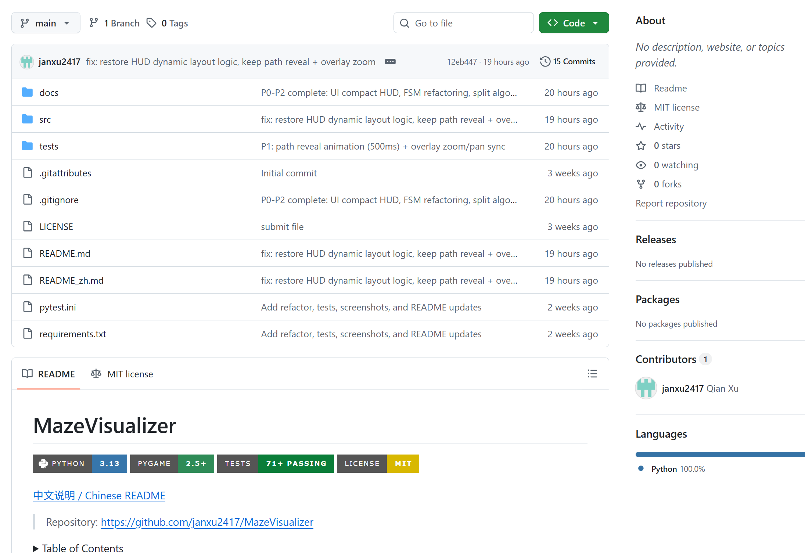

# MazeVisualizer

[Chinese README](README_zh.md)

## Project Background

MazeVisualizer demonstrates maze generation and pathfinding with step-by-step visualization.
The goal is to connect core data-structure and algorithm knowledge with a small interactive tool.

## Key Features

- Maze generation: DFS, Prim, Kruskal
- Maze types: Corridor (DFS), Dead-end (Prim), Prim Dense, Kruskal Sparse
- Pathfinding visualization: BFS, Dijkstra, A*, Bi-BFS, Greedy, Weighted A*
- Start menu with Help
- Menu options for size, complexity, maze type, and algo selection
- Controls for pause, solver reset, algorithm switching, and new maze

## Core Algorithms

### Maze Generation (DFS Backtracking)

- Grid uses 0 = wall, 1 = path
- Rows and columns are adjusted to odd values so the carving step can skip
  over walls and keep a clean wall/path structure
- Loop chance opens extra walls to create cycles

### Pathfinding

- **BFS** for shortest paths on unweighted grids
- **Dijkstra** as a weighted shortest-path baseline (uniform weights here)
- **A*** with Manhattan distance heuristic
- **Bi-BFS** expands from start and goal simultaneously
- **Greedy Best-First** uses only the heuristic (fast but not optimal)
- **Weighted A*** uses $f(n)=g(n)+W\times h(n)$ to trade accuracy for speed

## Controls

- Space: pause/resume
- H: help panel (pauses)
- N: single step while paused (hold for continuous)
- +/-: speed up / slow down
- [ / ]: adjust Weighted A* W
- R: restart solver on the same maze
- 1/2/3: switch BFS/Dijkstra/A*
- 4/5/6: switch Bi-BFS/Greedy/Weighted A*
- M: generate a new maze
- ESC: return to menu / close help panel

## Run

1. Install dependencies:
   - `python -m pip install -r requirements.txt`
2. Start the app:
   - `python src/main.py`
   - (or) `python src/ui.py`

## Engineering Notes

- Logic/UI separation: algorithms live in `src/algorithms.py`, rendering and
  input handling live in `src/ui.py`.
- Each solver is a generator; the UI consumes one step per frame for animation.

## Docs and Screenshots

Place screenshots or GIFs in `docs/` and include them in the PDF report.

## AI Tool Declaration

AI-assisted work: GitHub Copilot helped draft UI scaffolding and README text.
Core algorithm implementations were reviewed and adjusted manually.
